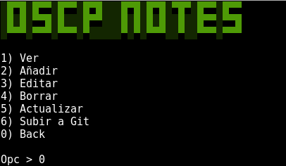
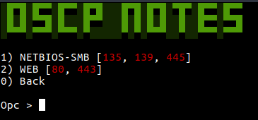
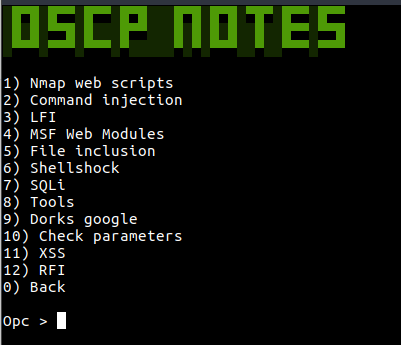

# OSCP - Notas

Aplicación hecha en Python v2.7 para gestionar los apuntes usados en los laboratorios del OSCP.

* Necesario hacer un fork o bajarse el código y subirlo cada uno a su Github, ya que si no, a la hora de actualizar o subir lo intentará hacer a mi cuenta y no os dejará sin saber la contraseña * 

No he incluido mis apuntes, porque considero muy necesario que cada uno se haga sus propios cheatsheets a la vez que va aprendiendo y poniendo en práctica los conocimientos adquiridos. A parte de que cada persona le gustaría tenerlos organizados de una forma.

Incluyo dos módulos y una notas por cada uno, a modo de ejemplo muy básico de la estructura que se podría seguir.

## Instalación

``` 
  git clone https://github.com/hriesco/OSCP_notas.git
  sudo ./install 
```

*Recomiendo que si se va a usar la aplicación con un usuario que no sea root se indique en la instalación cuando pregunte por el nombre de usuario para que cambie los permisos a la carpeta.*

## Aplicación notas

- Menu principal con las acciones básicas de Ver, Añadir, Editar y Borrar una nota o módulo, así como Actualizar y subir a Git los ultimos cambios realizados.



- Lista de modulos encontrados en la carpeta Notas



- Listado de notas disponibles dentro del módulo



- Nota impresa


## Nombre de módulos

- El módulo debe seguir el siguiente formato para que la aplicación funcione correctamente:

[NOMBRE-MODULO_PUERTO1_PUERTO2]

- Ejemplos:

NETBIOS-SMB_135_139_445

SSH_22


## Notas

- Formato nombre de notas

Nombre_nota_[Texto_En_Rojo].txt

- Ejemplo

Reverse_Shell_[NETCAT].txt

- Para poner un comentario y que aparezca la linea en azul, empezar el texto con un \#.
